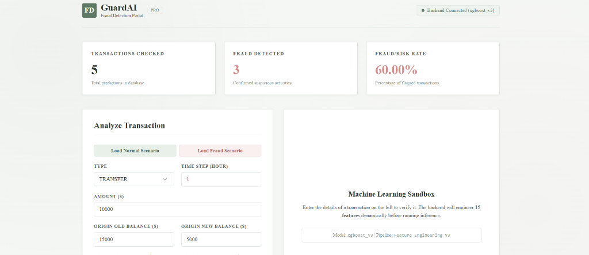

# GuardAI: Explainable ML-Powered Financial Fraud Detection Portal

GuardAI is an enterprise-grade, real-time transaction risk evaluation platform designed for modern financial ecosystems. By integrating an **XGBoost machine learning classifier** with **SHAP (SHapley Additive exPlanations)**, the system transitions from a black-box model to an Explainable AI (XAI) platform. It provides compliance officers and analysts with immediate, transparent insights into *why* a transaction was flagged as high-risk.



---

## Key Features

1. **Real-time Risk Scoring & Assessment**
   * Instantaneous probability evaluation of inbound transactions.
   * Clear, high-visibility visual categorization (Safe vs. High Risk Flagged).
2. **Explainable AI (SHAP Integration)**
   * Computes individual feature impact values for every prediction.
   * Extracts and displays the top 3 decision drivers influencing the model's output.
   * Maps complex ML features to clear, human-friendly business reasons (e.g., *Large Sender Balance Change*, *New Destination Account*).
3. **Automated Feature Engineering**
   * Dynamically constructs 15 features from raw transaction inputs, including log-scale transaction volume, sender/receiver balance differentials, zero-balance flags, and one-hot encoded transaction types.
4. **Professional Sage Green & Serif UI**
   * Clean, distraction-free dashboard styled with a light-sage and pastel color palette.
   * Formal typography set in Times New Roman, optimized for analytical and corporate presentation.
5. **Persistent Auditing & Logs**
   * Stores transaction parameters, prediction outcomes, and probability scores in a MySQL relational database.

---

## 🛠️ Technology Stack

| Component | Technology | Description |
| :--- | :--- | :--- |
| **Frontend** | React 19, Vite, Axios | Modern, responsive client utilizing vanilla CSS for performance. |
| **Backend** | FastAPI, Uvicorn | High-performance, asynchronous Python web server. |
| **Machine Learning** | XGBoost, SHAP, scikit-learn | Classifier trained on simulated mobile money transaction data. |
| **Database** | MySQL, SQLAlchemy ORM | Relational storage for transaction audits and logs. |
| **Environment** | python-dotenv, virtualenv | Secure configuration and isolated dependency management. |

---

## Project Structure

```text
├── backend/
│   ├── database/             # SQLAlchemy engine, session configurations, and tables
│   ├── models/               # Serialized models (XGBoost v3, feature names)
│   ├── schemas/              # Pydantic data schemas (RawTransaction validator)
│   ├── services/             # Core ML pipeline & database insert services
│   └── main.py               # FastAPI entry point, CORS config, and SHAP endpoints
├── database/
│   └── schema.sql            # MySQL table structure definition
├── docs/
│   └── dashboard.png         # Screenshot asset for documentation
├── frontend/
│   ├── src/
│   │   ├── components/       # StatsCards, PredictionForm, PredictionResult, Table
│   │   ├── pages/            # Dashboard page layout
│   │   ├── services/         # Axios API connection handlers (api.js)
│   │   ├── App.jsx           # Application entry-router
│   │   ├── index.css         # Sage-green styling & layout sheets
│   │   └── main.jsx          # DOM rendering entry-point
│   └── package.json          # Node dependencies & npm commands
└── .env                      # Database configuration variables
```

---

## 🚀 Setup & Installation

### Prerequisites
* **Python 3.11**
* **Node.js** (v18 or higher)
* **MySQL Server**

---

### Step 1: Database Setup
1. Log into your MySQL instance and create the database:
   ```sql
   CREATE DATABASE fraudshield;
   ```
2. Create the necessary tables using [schema.sql]
   ```bash
   mysql -u root -p fraudshield < database/schema.sql
   ```
3. Update the root .env file with your database credentials:
   ```env
   DB_USER=root
   DB_PASSWORD=your_password
   DB_HOST=localhost
   DB_NAME=fraudshield
   ```

---

### Step 2: Backend Setup
1. Open a terminal in the project root and activate the virtual environment:
   ```powershell
   .\ven\Scripts\Activate.ps1
   ```
2. Navigate to the `backend` folder and start the API server:
   ```bash
   cd backend
   uvicorn main:app --reload
   ```
   The backend server will run on **`http://localhost:8000`**.

---

### Step 3: Frontend Setup
1. Open a **new terminal tab**, navigate to the `frontend` folder, and install dependencies:
   ```bash
   cd frontend
   npm install
   ```
2. Run the Vite development server:
   ```bash
   npm run dev
   ```
   The client application will run on **`http://localhost:5173`**.

---

## Testing Scenarios

Use the dashboard's autofill utility buttons to run immediate pipeline evaluations:

### A. Low-Risk Scenario
* **Action:** Click the **Load Normal Scenario** button.
* **Attributes:** Standard transaction type (e.g., `CASH_OUT`), low amount, matching sender/recipient balances.
* **Expected Result:** **Transaction Safe** assessment, low probability score, with SHAP listing balanced transaction indicators.

### B. High-Risk Scenario
* **Action:** Click the **Load Fraud Scenario** button.
* **Attributes:** High volume `TRANSFER`, fully depleting the sender's origin balance, routing into a new destination account (`dest_zero`).
* **Expected Result:** **High Risk Flagged** assessment, high probability (>99%), with SHAP highlighting *Large Sender Balance Change*, *Transfer Transaction*, and *Large Amount Relative To Balance*.
